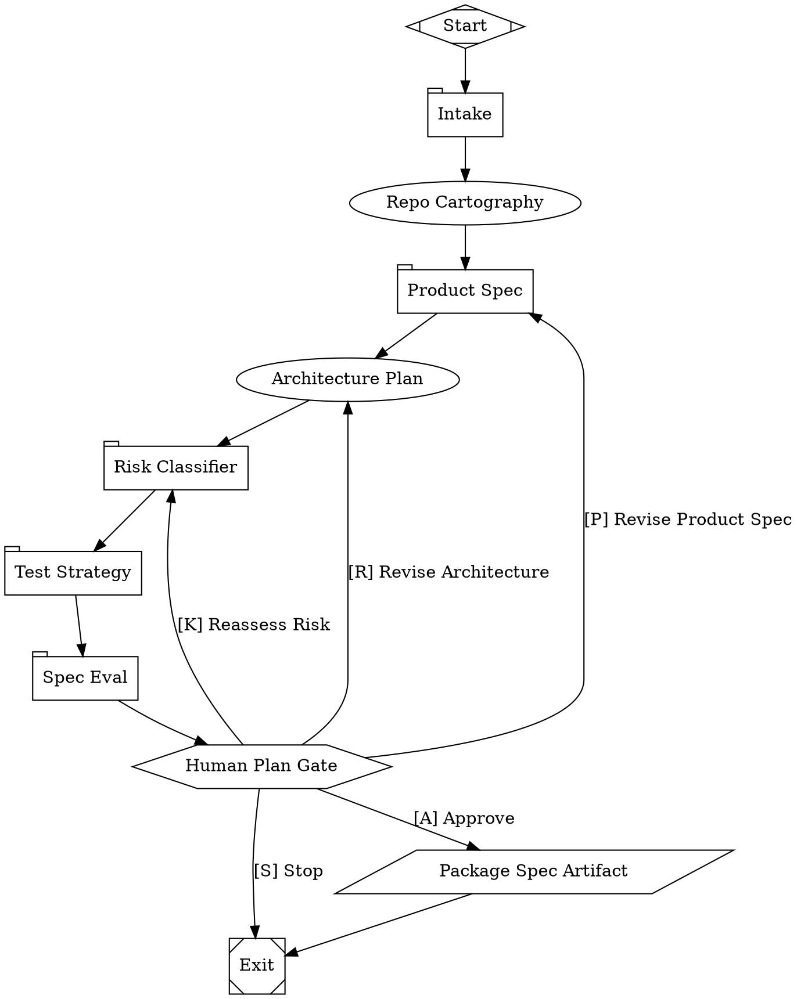
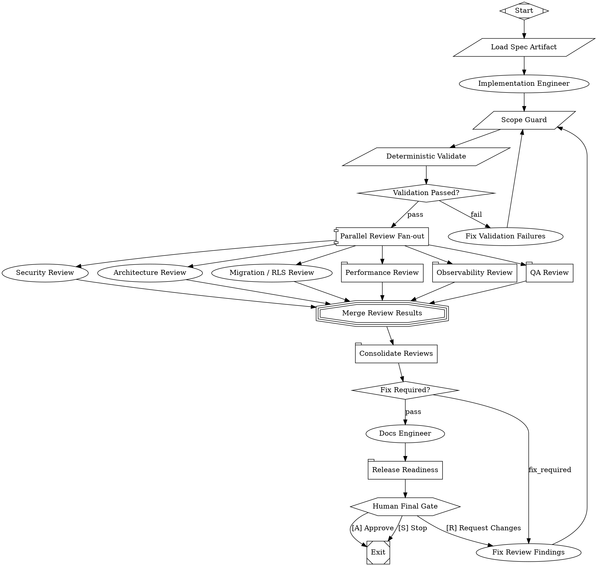
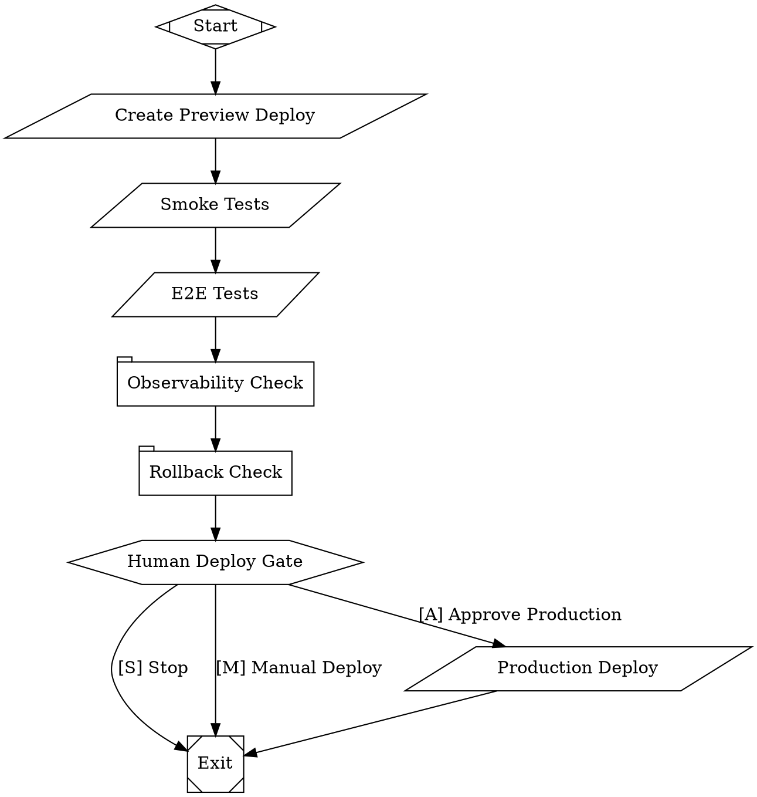

# Maestro Fabro Software Factory — Final Technical Design

**Version:** 1.0  
**Date:** 2026-05-21  
**Owner:** Ajmal / Maestro Architecture  
**Status:** Final design proposal for implementation  
**Primary runtime:** Fabro workflow engine  
**Primary repository context:** Maestro V2 / Maestro GTM monorepo

---

## 0. Executive Summary

The “perfect software factory” is not a single giant prompt and not a fully autonomous replacement for engineering judgment. It is a **measurable, version-controlled, human-gated engineering system** that uses Fabro to orchestrate specialized AI agents, deterministic command checks, parallel independent reviews, release gates, Git checkpoints, and post-run retrospectives.

The final recommended topology is:

```text
Spec Factory  →  Build Factory  →  Deploy Factory  →  Retrospective / Evals Loop
```

The core design combines two patterns:

1. **Two-pass workflow architecture**: separate the “decide what to build” phase from the “build it” phase.
2. **Parallel review fan-out**: after validation passes, run QA, security, architecture, database/migration, performance, and observability reviews concurrently, then merge findings into one consolidated decision.

This creates a software factory that behaves like a senior engineering team:

```text
Product Manager → Architect → Risk Reviewer → Human Plan Approval
→ Engineer → CI/Test Loop → Independent Review Board → Release Manager
→ Human Final Approval → PR / Deploy
```

The system is intentionally semi-autonomous. It should perform most implementation, review, and documentation work, but humans remain responsible for product judgment, high-risk decisions, migrations, production deploys, and business trade-offs.

---

## 1. Source Context and Design Assumptions

This document is based on:

- Fabro documentation and GitHub repository.
- The Maestro platform encyclopedia.
- The Maestro V2 product scope.
- Prior design discussion around linear DAG, parallel fan-out, and two-pass workflows.

### 1.1 Fabro facts used

Fabro is an open-source “dark software factory” for expert engineers. It lets teams define software processes as Graphviz DOT workflow graphs, then orchestrates AI agents, shell commands, human gates, parallel branches, checkpoints, API/server execution, and retrospectives.

Important Fabro capabilities used in this design:

- Graphviz DOT workflows.
- Agent nodes.
- Prompt nodes.
- Command nodes.
- Human gates.
- Conditional routing.
- Parallel fan-out and merge fan-in.
- Model stylesheets.
- Context fidelity controls.
- Docker / local / Daytona sandboxes.
- Git checkpoints and metadata branches.
- MCP server configuration for agents.
- GitHub pull request creation.
- Durable structured event streams.
- Artifacts collection.

### 1.2 Maestro context used

Maestro is a B2B SaaS platform for AI-powered LinkedIn GTM. The existing architecture includes:

- `apps/app`: main SaaS app, Next.js 15 / React 19.
- `apps/web`: SEO content hub.
- `apps/mcp-server`: HTTP MCP server.
- `apps/gtm-viewer`: ephemeral GTM data review tables.
- `packages/gtm`: domain business logic.
- `packages/mcp`: CLI + MCP tools.
- `packages/db`: Supabase client and DataScope utilities.
- `packages/ui`: design system.
- `packages/integrations`: external API clients.
- `packages/logging`: structured logging.

Maestro V2 adds a product direction centered on voice-first GTM workflows, MCP-first architecture, modular product modules, LinkedIn OAuth-only safety, and agent architecture using Hermes plus Fabro.

---

## 2. Definition of “Perfect Software Factory”

A perfect Fabro software factory has eight properties:

1. **Repeatable**: the process lives in version-controlled `.fabro` files, not in someone’s memory.
2. **Inspectable**: every stage has outputs, events, artifacts, token usage, costs, and checkpoints.
3. **Human-gated where risk matters**: humans approve plan, high-risk work, final merge, and deploy.
4. **Deterministically verified**: linters, typecheckers, unit tests, build checks, migrations, and E2E tests are command gates.
5. **Independently reviewed**: reviewers are isolated agents, ideally using different models/providers from the implementer.
6. **Risk-aware**: auth, billing, database, RLS, external integrations, and deployment changes trigger stricter gates.
7. **Measurable**: success is tracked by scores, pass rates, retries, cost, duration, and post-merge defects.
8. **Optimizable**: each run feeds a retrospective loop that improves prompts, evals, model routing, and workflow topology.

The design goal is not “AI does everything.” The design goal is:

```text
AI performs repeatable engineering labor.
Fabro enforces process, traceability, and gates.
Humans own judgment, trade-offs, risk acceptance, and shipping decisions.
```

---

## 3. System Architecture

### 3.1 High-level topology

```text
┌──────────────────────┐
│  Human / Product Ask │
└──────────┬───────────┘
           │
           ▼
┌──────────────────────┐
│    Spec Factory      │
│  clarify + plan      │
└──────────┬───────────┘
           │ approved spec artifact
           ▼
┌──────────────────────┐
│    Build Factory     │
│ implement + verify   │
└──────────┬───────────┘
           │ release-ready PR
           ▼
┌──────────────────────┐
│   Deploy Factory     │
│ preview + smoke test │
└──────────┬───────────┘
           │ production / staging outcome
           ▼
┌──────────────────────┐
│ Retrospective/Evals  │
│ improve the factory  │
└──────────────────────┘
```

### 3.2 Workflow inventory

```text
.fabro/workflows/
  maestro-spec.fabro          # Product + architecture + risk planning
  maestro-build.fabro         # Implementation + validation + parallel review
  maestro-deploy.fabro        # Preview deploy + smoke/E2E + final deploy gate
  maestro-pr-review.fabro     # Review an existing PR without implementing
  maestro-bugfix.fabro        # Incident/bug-focused debugging workflow
  maestro-refactor.fabro      # Architecture-controlled refactor workflow
  maestro-retro.fabro         # Post-run analysis and prompt/workflow improvement
```

---

## 4. Recommended Topology Decision

### 4.1 Rejected option: pure linear DAG

A linear DAG is good for learning:

```text
intake → product → architect → risk → approve → implement → validate ⇄ fix → qa → security → arch → release
```

But it is too slow for mature work because reviewers serialize. QA does not need to wait for security, security does not need to wait for architecture, and migration review does not need to wait for QA.

Use this only for:

- First week learning.
- Tiny changes.
- Debugging the workflow itself.

### 4.2 Recommended option: two-pass + parallel review fan-out

The mature factory should split the process into two workflows:

```text
maestro-spec.fabro
  request → intake → product_spec → architecture_plan → risk → spec_eval → human_plan_gate → spec artifact

maestro-build.fabro
  spec artifact → implement → validate/fix loop → parallel reviewers → consolidate → docs → release → final_gate
```

After validation passes, run review stages concurrently:

```text
                         ┌→ qa_review ───────────┐
                         ├→ security_review ─────┤
validate green ─→ fanout ├→ architecture_review ─┤→ merge → consolidate_reviews
                         ├→ migration_review ────┤
                         ├→ performance_review ──┤
                         └→ observability_review ┘
```

### 4.3 Why this is the mature design

- Human plan approval becomes a natural boundary.
- Builds can be rerun against the same approved spec.
- Model/prompt experiments become measurable.
- Reviewers are independent and parallel.
- Failed reviewers do not block unrelated reviewers.
- Consolidation prevents “agent chaos.”
- Artifacts provide traceability.
- Spec and build phases can be tuned separately.

---

## 5. Role Architecture: AI Team Members

| Role | Node Type | Tools | Permission | Model Class | Purpose |
|---|---|---:|---|---|---|
| Intake Analyst | prompt/agent | read | read-only | cheap/reasoning | Clarify ask and unknowns |
| Product Manager | prompt | none/read | read-only | cheap/reasoning | User stories, acceptance criteria |
| Repo Cartographer | agent | grep/read | read-only | cheap/long-context | Find affected areas |
| Architect | agent | read/grep | read-only | strong reasoning | Implementation plan, trade-offs |
| Risk Classifier | prompt | none | read-only | fast reasoning | Risk level and gates |
| Spec Evaluator | prompt | none | read-only | independent reviewer | Score spec quality |
| Implementation Engineer | agent | file/shell | full in sandbox | strongest coding | Code changes |
| Fix Engineer | agent | file/shell | full in sandbox | strongest coding | Fix validation failures |
| Scope Guard | command | git diff | n/a | deterministic | Detect unrelated changes |
| Validation Runner | command | shell | n/a | deterministic | lint/type/test/build |
| QA Reviewer | agent/prompt | read | read-only | independent | Functional correctness |
| Security Reviewer | agent | read/grep | read-only | security/reasoning | Auth/RLS/secrets/webhooks |
| Architecture Reviewer | agent | read/grep | read-only | independent strong | Coupling, maintainability |
| Migration Reviewer | agent | read/grep | read-only | strong | DB/RLS/data safety |
| Performance Reviewer | agent | read/grep | read-only | medium | Queries, latency, caching |
| Observability Reviewer | agent | read/grep | read-only | medium | Logs, metrics, error handling |
| Consolidator | prompt/agent | read | read-only | strong reasoning | Merge findings and decide |
| Docs Engineer | agent | write | read-write | cheap | Docs/changelog |
| Release Manager | prompt | none | read-only | cheap | Release notes, rollback plan |
| Human Architect | human gate | n/a | n/a | human | Plan/risk/final approval |

### 5.1 Important reviewer rule

Reviewers should produce **findings**, not mutate code. The only stages allowed to write code should be:

- Implementation Engineer.
- Fix Engineer.
- Fix Review Findings.
- Docs Engineer.

This prevents multiple parallel agents from editing the same files and creating unstable diffs.

---

## 6. Repository Structure

```text
.fabro/
  project.toml

  workflows/
    maestro-spec.fabro
    maestro-spec.toml
    maestro-build.fabro
    maestro-build.toml
    maestro-deploy.fabro
    maestro-deploy.toml
    maestro-pr-review.fabro
    maestro-bugfix.fabro
    maestro-retro.fabro

  prompts/
    shared/
      maestro-repo-map.md
      maestro-architecture-rules.md
      maestro-risk-policy.md
      output-contracts.md
      reviewer-json-contract.md
      no-unrelated-refactors.md

    spec/
      intake.md
      repo-cartographer.md
      product-manager.md
      architect.md
      risk-classifier.md
      test-strategy.md
      spec-evaluator.md

    build/
      implementer.md
      fixer.md
      qa-reviewer.md
      security-reviewer.md
      architecture-reviewer.md
      migration-reviewer.md
      performance-reviewer.md
      observability-reviewer.md
      consolidate-reviews.md
      release-manager.md

    deploy/
      preview-check.md
      deploy-manager.md
      rollback-check.md

    retro/
      run-retrospective.md
      prompt-improvement.md
      eval-calibration.md

  evals/
    schemas/
      spec-eval.schema.json
      risk-report.schema.json
      validation.schema.json
      review-finding.schema.json
      consolidated-review.schema.json
      release-readiness.schema.json
      factory-retro.schema.json

    scorecards/
      spec-scorecard.md
      architecture-scorecard.md
      security-scorecard.md
      migration-scorecard.md
      performance-scorecard.md
      observability-scorecard.md
      release-scorecard.md

  scripts/
    validate.sh
    affected-packages.sh
    collect-diff.sh
    scope-guard.sh
    package-spec.sh
    unpack-spec.sh
    eval-json.js
    release-readiness.sh
    detect-risk-surfaces.sh
    check-migrations.sh
    check-rls.sh
    smoke-preview.sh
```

---

## 7. Shared Maestro Factory Rules

Create `.fabro/prompts/shared/maestro-architecture-rules.md`:

```md
# Maestro Architecture Rules

You are working inside the Maestro GTM monorepo.

## System map
- apps/app: main SaaS dashboard, Next.js App Router, React 19.
- apps/web: SEO content hub.
- apps/mcp-server: HTTP MCP server and API tools.
- apps/gtm-viewer: standalone data review tables.
- packages/gtm: pure domain services. No framework deps. Supabase injected.
- packages/mcp: CLI + MCP tools.
- packages/db: Supabase client factories and DataScope utilities.
- packages/ui: shared design system.
- packages/types: shared DB column types.
- packages/integrations: external API clients.
- packages/logging: structured logging.

## Non-negotiables
- Preserve multi-tenancy boundaries.
- Always respect DataScope.
- Never bypass Supabase RLS casually.
- Do not expose secrets to client code.
- Do not introduce broad refactors unless explicitly requested.
- Keep Next.js route handlers thin; route → service → repository → database.
- Prefer domain services in packages/gtm when logic spans features.
- Keep UI components small and testable.
- For V2, every core product feature should be expressible as an MCP tool first and UI second.

## High-risk areas
- auth / onboarding / sessions
- team switching and DataScope
- billing / Stripe
- Supabase migrations / RLS policies
- webhooks
- LinkedIn providers
- email sending
- background jobs
- AI provider keys / BYOK
- MCP server tools and permissions
```

---

## 8. Workflow 1 — Spec Factory

### 8.1 Purpose

Turn a vague request into an approved implementation contract.

### 8.2 Stages

```text
start
→ intake
→ repo_cartography
→ product_spec
→ architecture_plan
→ risk_classifier
→ test_strategy
→ spec_eval
→ human_plan_gate
→ package_spec
→ exit
```

### 8.3 Outputs

```text
.factory/spec/intake.md
.factory/spec/repo-map.md
.factory/spec/product-spec.md
.factory/spec/architecture-plan.md
.factory/spec/risk-report.json
.factory/spec/test-strategy.md
.factory/spec/spec-eval.json
.factory/spec/approved-spec.tar.gz
```

### 8.4 `maestro-spec.fabro`



### 8.5 Spec pass rules

The spec workflow passes only when:

- Product acceptance criteria are explicit.
- Non-goals are documented.
- Architecture plan lists files/packages likely affected.
- Risk report is valid JSON.
- Test strategy maps each acceptance criterion to at least one verification.
- Spec eval score is >= 4.0 / 5.0.
- Human plan gate is approved.

---

## 9. Workflow 2 — Build Factory

### 9.1 Purpose

Build the approved spec, run deterministic validation, review in parallel, consolidate findings, fix blockers, produce release notes, and create a PR.

### 9.2 Stages

```text
load_spec
→ implement
→ scope_guard
→ validate ⇄ fix_validation
→ parallel_review_fanout
→ merge_reviews
→ consolidate_reviews
→ review_eval
→ fix_review_findings? ⇄ validate
→ docs
→ release_readiness
→ final_gate
→ exit
```

### 9.3 `maestro-build.fabro`



### 9.4 Build pass rules

The build workflow passes only when:

- Scope guard passes.
- Lint/typecheck/test/build pass.
- Review consolidation has no unwaived BLOCKER or HIGH findings.
- Release readiness artifact exists.
- Human final gate is approved.

---

## 10. Workflow 3 — Deploy Factory

### 10.1 Purpose

Safely deploy a release-ready PR or branch to preview/staging, run smoke/E2E/observability checks, and optionally prepare production deployment.

### 10.2 `maestro-deploy.fabro`



Production deployment should remain manual until the factory has a reliable track record.

---

## 11. Run Configuration

### 11.1 Project defaults — `.fabro/project.toml`

```toml
_version = 1

[run.model]
name = "claude-sonnet-4-5"
fallbacks = ["openai", "gemini"]

[run.model.controls]
reasoning_effort = "high"

[run.sandbox]
provider = "docker"
preserve = false

[run.sandbox.docker]
image = "node:22-bookworm"
network_mode = "bridge"
memory_limit = "8GB"
cpu_quota = 400000

[run.checkpoint]
exclude_globs = [
  "**/node_modules/**",
  "**/.next/**",
  "**/.turbo/**",
  "**/dist/**",
  "**/coverage/**",
  "**/playwright-report/**"
]

[run.artifacts]
include = [
  ".factory/**",
  "test-results/**",
  "playwright-report/**",
  "coverage/**",
  "*.trace.zip"
]

[run.integrations.github.permissions]
contents = "write"
pull_requests = "write"
issues = "read"

[run.pull_request]
enabled = true
draft = true
auto_merge = false
merge_strategy = "squash"
```

### 11.2 Spec run config — `maestro-spec.toml`

```toml
_version = 1

[workflow]
graph = "maestro-spec.fabro"

[run]
goal = "Create an approved implementation spec for the requested Maestro change."

[run.inputs]
request = "{{ env.MAESTRO_CHANGE_REQUEST }}"

[[run.prepare.steps]]
script = "pnpm install --frozen-lockfile"

[[run.prepare.steps]]
script = "mkdir -p .factory/spec .factory/build .factory/reviews"
```

### 11.3 Build run config — `maestro-build.toml`

```toml
_version = 1

[workflow]
graph = "maestro-build.fabro"

[run]
goal = "Implement the approved Maestro spec and produce a release-ready PR."

[run.inputs]
spec_artifact = ".factory/spec/approved-spec.tar.gz"

[[run.prepare.steps]]
script = "pnpm install --frozen-lockfile"

[[run.prepare.steps]]
script = "mkdir -p .factory/build .factory/reviews .factory/release"

[run.agent.mcps.playwright]
type = "sandbox"
command = ["npx", "@playwright/mcp@latest", "--port", "3100", "--headless", "--browser", "chromium"]
port = 3100
startup_timeout = "60s"
tool_timeout = "2m"
```

---

## 12. Evals and Scorecards

The factory must use both deterministic checks and LLM-as-judge evals.

### 12.1 Eval boundary map

| Boundary | Eval | Type | Gate? |
|---|---|---|---|
| After spec | Spec Eval | LLM judge + JSON schema | Yes |
| After risk | Risk Eval | Rules + LLM | Yes for high risk |
| After implementation | Scope Guard | deterministic | Yes |
| After validation | CI Eval | deterministic | Yes |
| After parallel reviews | Review Consolidation | LLM judge + schema | Yes |
| Before final gate | Release Readiness | LLM + checklist | Yes |
| After run | Factory Retrospective | metrics + LLM | No, learning loop |

### 12.2 Spec Eval

Score 0–5:

```text
clarity
acceptance_criteria_quality
non_goals_defined
architecture_fit
risk_identification
testability
rollback_clarity
scope_control
```

Pass condition:

```text
overall_score >= 4.0
blocking_issues.length == 0
risk_report.valid == true
test_strategy.exists == true
```

Schema:

```json
{
  "decision": "pass | revise | fail",
  "overall_score": 4.3,
  "scores": {
    "clarity": 5,
    "acceptance_criteria_quality": 4,
    "non_goals_defined": 4,
    "architecture_fit": 5,
    "risk_identification": 4,
    "testability": 4,
    "rollback_clarity": 4,
    "scope_control": 5
  },
  "blocking_issues": [],
  "recommended_revision_node": null
}
```

### 12.3 Risk Eval

Risk dimensions:

```text
auth
authorization
Supabase RLS
tenant isolation
billing / Stripe
database migrations
webhooks
external integrations
background jobs
email sending
LinkedIn providers
MCP tool exposure
AI provider keys / BYOK
production deployment
```

Risk policy:

```text
LOW:
  normal workflow

MEDIUM:
  require QA + architecture review

HIGH:
  require QA + security + architecture + migration review
  require human final gate

CRITICAL:
  stop autonomous implementation
  require human architect intervention
```

### 12.4 Scope Guard

Purpose: prevent AI from changing too much.

Checks:

```text
unexpected files changed
unexpected package/dependency changes
large diffs beyond threshold
changes to auth/billing/db without risk flag
removal of tests
secret-like values added
broad refactors not in spec
```

Example output:

```json
{
  "decision": "pass",
  "lines_added": 214,
  "lines_removed": 61,
  "unexpected_files": [],
  "dependency_changes": false,
  "risky_surface_touched": [],
  "unrelated_refactor_detected": false
}
```

### 12.5 Deterministic Validation

Minimum commands:

```bash
pnpm lint
pnpm typecheck
pnpm test
pnpm build
```

Preferred monorepo-aware commands:

```bash
pnpm turbo lint --filter=...
pnpm turbo typecheck --filter=...
pnpm turbo test --filter=...
pnpm turbo build --filter=...
```

Output schema:

```json
{
  "decision": "pass | fail",
  "commands": [
    { "name": "lint", "status": "pass", "duration_seconds": 33 },
    { "name": "typecheck", "status": "pass", "duration_seconds": 70 },
    { "name": "test", "status": "pass", "duration_seconds": 110 },
    { "name": "build", "status": "pass", "duration_seconds": 190 }
  ],
  "failed_commands": [],
  "artifact_paths": []
}
```

### 12.6 Review Finding Contract

Every reviewer must output JSON:

```json
{
  "reviewer": "security_review",
  "decision": "pass | fix_required | human_review_required | fail",
  "summary": "Short summary.",
  "findings": [
    {
      "id": "SEC-001",
      "severity": "BLOCKER | HIGH | MEDIUM | LOW | NIT",
      "category": "auth | rls | api | tests | architecture | docs | performance | observability",
      "file": "path/to/file.ts",
      "line": 123,
      "issue": "What is wrong",
      "evidence": "Why this is likely wrong",
      "recommendation": "How to fix",
      "must_fix": true
    }
  ]
}
```

### 12.7 Consolidated Review Contract

```json
{
  "decision": "pass | fix_required | human_review_required | fail",
  "blockers": [],
  "high": [],
  "medium": [],
  "low": [],
  "nits": [],
  "duplicate_findings_removed": 4,
  "false_positive_findings_removed": 2,
  "fix_plan": [
    {
      "finding_ids": ["ARCH-001", "QA-002"],
      "instruction": "Add missing test for workspace-scoped access."
    }
  ]
}
```

### 12.8 Release Readiness Eval

Required release artifact:

```text
.factory/release/release.md
```

Must contain:

```text
summary
files changed
commands run
test results
review results
known risks
manual QA steps
rollback plan
deployment notes
owner decision required
```

Pass condition:

```text
release_readiness_score >= 4.0
no unwaived blockers
rollback plan exists for medium/high risk changes
manual QA steps exist for UI changes
migration plan exists for DB changes
```

---

## 13. Scripts

### 13.1 `.fabro/scripts/validate.sh`

```bash
#!/usr/bin/env bash
set -euo pipefail

mkdir -p .factory/build

run_cmd() {
  local name="$1"
  shift
  echo "==> $name" | tee -a .factory/build/validation.log
  if "$@" 2>&1 | tee -a .factory/build/validation.log; then
    echo "$name: pass" >> .factory/build/validation.summary
  else
    echo "$name: fail" >> .factory/build/validation.summary
    return 1
  fi
}

run_cmd lint pnpm lint
run_cmd typecheck pnpm typecheck
run_cmd test pnpm test
run_cmd build pnpm build

cat > .factory/build/validation.json <<'JSON'
{
  "decision": "pass",
  "note": "All validation commands completed successfully."
}
JSON
```

### 13.2 `.fabro/scripts/scope-guard.sh`

```bash
#!/usr/bin/env bash
set -euo pipefail

mkdir -p .factory/build

git diff --name-only > .factory/build/changed-files.txt
ADDED=$(git diff --numstat | awk '{s+=$1} END {print s+0}')
REMOVED=$(git diff --numstat | awk '{s+=$2} END {print s+0}')

RISKY=$(grep -E '(^supabase/|migrations|rls|stripe|auth|middleware|webhook|provider_keys|apps/mcp-server)' .factory/build/changed-files.txt || true)
DEPS=$(grep -E '(^package.json$|pnpm-lock.yaml|bun.lock|Cargo.toml|Cargo.lock)' .factory/build/changed-files.txt || true)

DECISION="pass"
REASON=""

if [ "$ADDED" -gt 2500 ]; then
  DECISION="fail"
  REASON="Large diff: $ADDED lines added."
fi

if [ -n "$DEPS" ] && ! grep -q "dependency" .factory/spec/risk-report.json 2>/dev/null; then
  DECISION="fail"
  REASON="Dependency files changed without dependency risk flag."
fi

cat > .factory/build/scope-guard.json <<JSON
{
  "decision": "$DECISION",
  "lines_added": $ADDED,
  "lines_removed": $REMOVED,
  "risky_files": $(printf '%s\n' "$RISKY" | jq -R . | jq -s .),
  "dependency_files": $(printf '%s\n' "$DEPS" | jq -R . | jq -s .),
  "reason": "$REASON"
}
JSON

if [ "$DECISION" != "pass" ]; then
  cat .factory/build/scope-guard.json
  exit 1
fi
```

### 13.3 `.fabro/scripts/package-spec.sh`

```bash
#!/usr/bin/env bash
set -euo pipefail

mkdir -p .factory/spec

test -f .factory/spec/product-spec.md
test -f .factory/spec/architecture-plan.md
test -f .factory/spec/risk-report.json
test -f .factory/spec/test-strategy.md
test -f .factory/spec/spec-eval.json

tar -czf .factory/spec/approved-spec.tar.gz .factory/spec
```

### 13.4 `.fabro/scripts/unpack-spec.sh`

```bash
#!/usr/bin/env bash
set -euo pipefail

ARTIFACT="${1:-.factory/spec/approved-spec.tar.gz}"
test -f "$ARTIFACT"
tar -xzf "$ARTIFACT"
```

---

## 14. Human Gates

### 14.1 Plan Gate

Options:

```text
[A] Approve
[P] Revise Product Spec
[R] Revise Architecture
[K] Reassess Risk
[S] Stop
```

Plan gate must be used before code changes. It protects against building the wrong thing.

### 14.2 High-Risk Gate

Triggered if risk is HIGH or CRITICAL.

Options:

```text
[A] Accept risk and continue
[L] Lower scope
[M] Manual implementation required
[S] Stop
```

### 14.3 Final Gate

Options:

```text
[A] Approve PR / Merge candidate
[R] Request changes
[D] Docs-only correction
[S] Stop
```

### 14.4 Deploy Gate

Options:

```text
[A] Approve production deploy
[M] Manual deploy
[S] Stop
```

---

## 15. Model Routing Strategy

Use different models for different cognitive jobs.

| Work | Model class | Reason |
|---|---|---|
| Intake / docs / release notes | cheap fast model | Low risk, high volume |
| Architecture plan | strong reasoning | Trade-offs and system design |
| Implementation | coding-specialized model | Code writing and tool usage |
| Fix loop | same coding model/thread | Continuity matters |
| Security review | strong reasoning or security-tuned | High-stakes review |
| Independent review | different provider | Fresh eyes / reduced self-review bias |
| Consolidation | strong reasoning | Must merge competing findings |

Recommended stylesheet pattern:

```dot
graph [
  model_stylesheet="
    *                 { model: gpt-5-mini; reasoning_effort: medium; }
    .coding           { model: gpt-5.3-codex; reasoning_effort: high; }
    .architect        { model: claude-sonnet-4-5; reasoning_effort: high; }
    .security         { model: claude-sonnet-4-5; reasoning_effort: high; }
    .critic           { model: gemini-3.1-pro-preview; reasoning_effort: high; }
    .cheap            { model: gpt-5-mini; reasoning_effort: medium; }
  "
]
```

Important: exact model IDs should be verified with `fabro model list` and `fabro model test` on your machine.

---

## 16. Context Strategy

Fabro context is powerful, but too much context can cause agents to become slow, expensive, or overly influenced by prior stages.

Use this policy:

```text
Spec phase:
  intake: compact
  repo_cartography: summary:medium
  product_spec: summary:high
  architecture_plan: summary:high
  risk_classifier: summary:high
  spec_eval: summary:high

Build phase:
  implement: full + thread_id=implementation
  fix_validation: full + same thread_id
  reviewers: summary:high, no shared implementation thread
  consolidation: summary:high + parallel results
  docs/release: compact or summary:medium
```

Principle:

```text
Implementer needs continuity.
Reviewers need independence.
Consolidator needs all findings.
Docs need only final facts.
```

---

## 17. Sandbox and Security Policy

### 17.1 Default sandbox

Use Docker for local/initial factory work:

```toml
[run.sandbox]
provider = "docker"
preserve = false
```

Use Daytona for cloud, team, long-running, or high-isolation workloads:

```toml
[run.sandbox]
provider = "daytona"
preserve = false

[run.sandbox.daytona.snapshot]
name = "maestro-node-22"
cpu = 4
memory = "8GB"
disk = "30GB"
```

### 17.2 Permission policy

| Stage | Permission |
|---|---|
| Intake | read-only |
| Product | read-only |
| Architect | read-only |
| Risk | read-only |
| Implement | full in sandbox |
| Fix | full in sandbox |
| Reviewers | read-only |
| Docs | read-write |
| Deploy | command-only / human-gated |

Fabro’s read-before-write guardrail should remain enabled. Even when an agent has full access, it should not overwrite files it has not read.

### 17.3 Secrets policy

Never pass production secrets to normal build workflows. Use minimum environment variables.

Allowed examples:

```toml
[run.sandbox.env]
NODE_ENV = "test"
NEXT_PUBLIC_APP_URL = "http://localhost:3000"
```

Sensitive provider keys should be passed only to workflows that require them and only in isolated sandboxes.

---

## 18. MCP Integration Strategy

Fabro agents can use MCP servers. Add MCP gradually.

### 18.1 Phase 1 MCPs

```text
Playwright MCP
GitHub MCP / GitHub App permissions
Maestro MCP local/dev server
```

### 18.2 Phase 2 MCPs

```text
Supabase/Postgres MCP for schema inspection only
Vercel MCP for preview deployment state
Sentry MCP for error checks
Railway MCP/log access for mcp-server/gtm-viewer
Slack MCP for notifications
```

### 18.3 MCP safety rules

- Reviewers may use read-only MCPs.
- Implementers may use Playwright and local repo tools.
- Database writes through MCP are forbidden unless a human approves a high-risk gate.
- Production deploy tools are disabled by default.

---

## 19. GitHub and PR Policy

Fabro should create draft PRs by default.

```toml
[run.pull_request]
enabled = true
draft = true
auto_merge = false
merge_strategy = "squash"
```

PR title format:

```text
[Fabro] <short feature name>
```

PR body should include:

```text
Summary
Spec artifact link / run ID
Validation commands
Review findings
Risk level
Manual QA checklist
Rollback plan
Fabro run branch
Fabro metadata branch
```

Auto-merge should remain disabled until the factory demonstrates strong reliability.

---

## 20. Maestro-Specific Risk Rules

### 20.1 CRITICAL risk surfaces

Any change touching these requires manual human approval before implementation and before final merge:

```text
Supabase RLS policy changes
DataScope access logic
auth middleware
Stripe billing or webhooks
provider key encryption/BYOK
MCP server auth/session/rate-limits
production deployment config
```

### 20.2 HIGH risk surfaces

```text
database migrations
Trigger.dev jobs that mutate data
email sending flows
LinkedIn integration actions
webhooks from external providers
AI prompt templates for user-facing generation
admin impersonation
```

### 20.3 MEDIUM risk surfaces

```text
UI flows with workspace scoping
analytics calculations
lead capture forms
funnel publishing
content pipeline changes
MCP tool definitions
```

### 20.4 LOW risk surfaces

```text
copy changes
non-sensitive UI polish
docs
small isolated component changes
style updates
```

---

## 21. Architectural Quality Gates

Architecture review must evaluate:

```text
coupling
cohesion
bounded context fit
DataScope correctness
RLS alignment
thin route handler pattern
service/repository boundaries
package ownership
testability
observability
operational failure modes
```

Principle from software architecture: everything is a trade-off. Architecture reviewers must explicitly name the trade-off, not just declare something “good” or “bad.”

Example architecture finding:

```json
{
  "id": "ARCH-003",
  "severity": "HIGH",
  "category": "boundary",
  "issue": "Route handler now contains business logic and database access.",
  "evidence": "apps/app/src/app/api/.../route.ts now performs qualification scoring inline.",
  "recommendation": "Move scoring into packages/gtm or src/server/services and keep route handler as thin shell.",
  "must_fix": true
}
```

---

## 22. Factory Metrics

Track these per run:

```text
run_id
workflow_name
request_type
risk_level
spec_score
architecture_score
security_score
release_readiness_score
implementation_first_pass_rate
validation_fail_count
fix_loop_count
review_blocker_count
review_false_positive_count
tokens_by_stage
cost_by_stage
duration_by_stage
files_changed
lines_added
lines_removed
human_interventions
post_merge_defects
rollback_required
```

### 22.1 Factory KPIs

| Metric | Good target |
|---|---:|
| Spec pass rate after first plan | >70% |
| Implementation first validation pass | >50% initially, >75% mature |
| Average fix loops | <2 |
| Review false positive rate | <25% |
| Human intervention per low-risk run | <=2 |
| Post-merge defect rate | trending down |
| Median low-risk run time | <20 min |
| Median medium-risk run time | <45 min |

---

## 23. Retrospective Loop

Every run should produce:

```text
.factory/retro/run-retro.md
.factory/retro/metrics.json
.factory/retro/prompt-improvements.md
.factory/retro/workflow-improvements.md
```

The retrospective should answer:

```text
Which stage was slowest?
Which model cost most?
Which check failed?
Which reviewer found real issues?
Which reviewer produced noise?
Did the spec predict the actual files changed?
Did scope guard catch anything?
Were any human gates unnecessary?
Should prompts or eval thresholds change?
```

Optimization rule:

```text
Change one factory variable at a time.
Compare against baseline using the same approved spec artifact.
```

---

## 24. Implementation Roadmap

### Phase 0 — Install and validate Fabro

```bash
brew install fabro-sh/tap/fabro-nightly
fabro server start
cd maestro
fabro repo init
fabro model test
```

### Phase 1 — Minimal linear factory

Build:

```text
plan → human gate → implement → validate/fix → release summary
```

Goal: prove Fabro works in Maestro repo.

### Phase 2 — Add evals

Add:

```text
spec_eval
scope_guard
validation_json
release_readiness
```

Goal: move from “agent completed” to “factory measured.”

### Phase 3 — Parallel review fan-out

Add:

```text
qa_review
security_review
architecture_review
migration_review
merge_reviews
consolidate_reviews
```

Goal: faster, independent review.

### Phase 4 — Split two-pass workflows

Create:

```text
maestro-spec.fabro
maestro-build.fabro
```

Goal: stable specs, repeatable builds, prompt/model comparisons.

### Phase 5 — Deploy factory

Add:

```text
preview deploy
smoke tests
E2E tests
rollback check
deploy gate
```

Goal: release safety.

### Phase 6 — Self-host Fabro server

Run as service with API/server mode, web UI, and durable queue.

Goal: team-scale software factory.

---

## 25. Known Watchpoints from Fabro GitHub

Before relying on this in production, monitor the Fabro issue tracker for:

- Environment attributes on command/agent nodes.
- Provider model auto-discovery.
- JSON response envelope standardization.
- Production panic cleanup.
- Model fallback behavior.
- Loop restart behavior.

Mitigation:

- Run `fabro preflight` for every workflow before use.
- Keep workflows versioned.
- Keep the deployment factory human-gated.
- Do not enable auto-merge until reliability is proven.
- Keep fallback models explicit and tested.

---

## 26. Operating Procedure

### 26.1 Creating a feature

```bash
export MAESTRO_CHANGE_REQUEST="Add voice memo input to LinkedIn post creation with transcript save and draft generation."
fabro run .fabro/workflows/maestro-spec.toml
# approve plan gate
fabro run .fabro/workflows/maestro-build.toml
# review final gate
```

### 26.2 Reviewing an existing PR

```bash
fabro run .fabro/workflows/maestro-pr-review.fabro --goal "Review PR #123 for architecture, security, and Maestro V2 fit."
```

### 26.3 Debugging a failed run

```bash
fabro events <run_id> | jq 'select(.event == "stage.failed")'
fabro dump <run_id>
git checkout fabro/run/<run_id>
```

---

## 27. Final Recommendation

The final factory should be:

```text
Two-pass by default.
Parallel review by default.
Human-gated for plan, high risk, final merge, and deploy.
Deterministic validation before LLM review.
LLM review before release notes.
Git checkpointed after every stage.
MCP-enabled only where useful.
Measured after every run.
Improved through retrospectives.
```

The first production-ready implementation should include exactly three workflows:

```text
maestro-spec.fabro
maestro-build.fabro
maestro-deploy.fabro
```

Everything else is optional until these become stable.

This is the “perfect” Fabro software factory because it does not trust agents blindly. It gives agents a process, gives the process measurable gates, gives humans decision points, and gives the organization repeatable improvement.

---

## 28. Reference URLs

- Fabro homepage: https://fabro.sh/
- Fabro GitHub repository: https://github.com/fabro-sh/fabro
- Fabro docs index: https://docs.fabro.sh/llms.txt
- Fabro nodes and stages: https://docs.fabro.sh/workflows/stages-and-nodes
- Fabro run configuration: https://docs.fabro.sh/execution/run-configuration
- Fabro models: https://docs.fabro.sh/core-concepts/models
- Fabro context: https://docs.fabro.sh/execution/context
- Fabro checkpoints: https://docs.fabro.sh/execution/checkpoints
- Fabro observability: https://docs.fabro.sh/execution/observability
- Fabro permissions: https://docs.fabro.sh/agents/permissions
